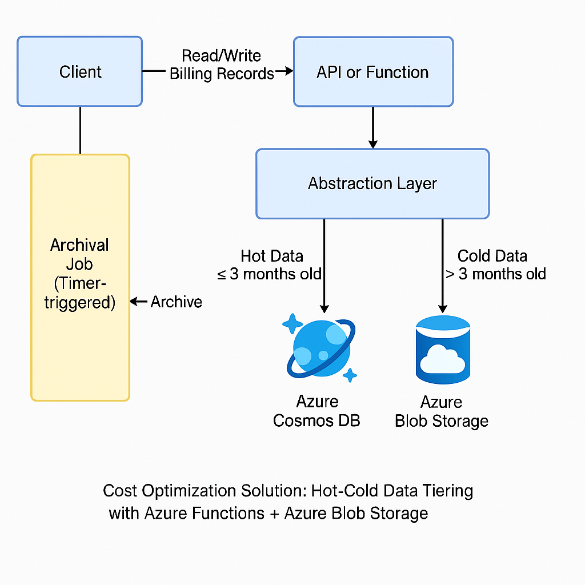

**Azure Cosmos DB Cost Optimization with Hot-Cold Data Tiering in Serverless Architecture**

---

### **Overview**

In a serverless Azure architecture, billing records are stored in Azure Cosmos DB. The system is read-heavy, but most records older than 3 months are rarely accessed. Over time, the database size has grown significantly, leading to higher costs. This document outlines a cost-effective solution that maintains data availability, ensures no data loss or downtime, and requires no changes to existing API contracts.

---

### **Current System Constraints**

* **Record Size:** Up to 300 KB per record
* **Total Records:** Over 2 million
* **Access Latency:** Old records should be served within a few seconds
* **Constraints:**

  * No data loss
  * No downtime
  * No changes to existing API contracts

---

### **Proposed Solution: Hot-Cold Data Tiering**

Split data into two tiers:

* **Hot Data:** Records <= 3 months old in Azure Cosmos DB
* **Cold Data:** Records > 3 months old in Azure Blob Storage (Cool tier)

Use an abstraction layer to determine data location at runtime.

---

### **Architecture Diagram**

```plaintext
+--------+       Read/Write       +------------------+                     
| Client | ---------------------> | API or Function  |                     
+--------+                        +--------+---------+                     
                                         |                                 
                                         v                                 
                               +---------------------+                    
                               |  Abstraction Layer  |                    
                               +---------+-----------+                    
                                         |                                 
                   +---------------------+---------------------+         
                   |                                           |         
     <= 3 months   v                                           v  > 3 months
         +-------------------+                     +----------------------+
         |  Azure Cosmos DB  |                     | Azure Blob Storage   |
         +-------------------+                     +----------------------+
                                                                 ^         
                                                                 |         
                             +--------------------------+       |         
                             | Archival Job (Timer Func)|-------+         
                             +--------------------------+                 
```

---

### **Implementation Steps**

#### **1. Add Date or Archive Flag**

Ensure each record has a timestamp (e.g., `recordDate`).

#### **2. Cold Storage Setup**

* Create Azure Blob Storage container in Cool tier.
* Save records as JSON blobs.
* Use naming pattern `/YYYY/MM/DD/recordId.json`.

#### **3. Archival Function (Timer Trigger)**

Python pseudocode:

```python
from azure.cosmos import CosmosClient
from azure.storage.blob import BlobServiceClient
from datetime import datetime, timedelta
import json

# Init
cutoff_date = datetime.utcnow() - timedelta(days=90)
query = f"SELECT * FROM c WHERE c.recordDate < '{cutoff_date.isoformat()}'"

old_records = list(container.query_items(query, enable_cross_partition_query=True))

for record in old_records:
    blob_name = f"{cutoff_date.year}/{cutoff_date.month}/{record['id']}.json"
    blob_container.upload_blob(blob_name, json.dumps(record), overwrite=True)
    container.delete_item(record['id'], partition_key=record['partitionKey'])
```

#### **4. Read Logic with Fallback**

```python
def get_billing_record(record_id):
    try:
        return cosmos_container.read_item(record_id, partition_key=record_id)
    except:
        blob_path = find_blob_path(record_id)  # Lookup or construct
        blob = blob_container.get_blob_client(blob_path).download_blob().readall()
        return json.loads(blob)
```

#### **5. Optional Indexing**

* Maintain `record_id -> blob_path` mapping in lightweight Cosmos DB or Table Storage.

---

### **Terraform for Blob Cool Tier**

```hcl
resource "azurerm_storage_account" "example" {
  name                     = "billingstorage"
  resource_group_name      = "rg-billing"
  location                 = "East US"
  account_tier             = "Standard"
  account_replication_type = "LRS"
}

resource "azurerm_storage_container" "archived" {
  name                  = "archived-billing-records"
  storage_account_name  = azurerm_storage_account.example.name
  container_access_type = "private"
}

resource "azurerm_storage_management_policy" "archive_policy" {
  storage_account_id = azurerm_storage_account.example.id

  rule {
    name    = "move_to_cool"
    enabled = true

    filters {
      blob_types = ["blockBlob"]
      prefix_match = ["archived-billing-records/"]
    }

    actions {
      base_blob {
        tier_to_cool_after_days_since_modification_greater_than = 0
      }
    }
  }
}
```

---

### **Monitoring and Alerts**

* Use **Azure Monitor** and **Application Insights** to:

  * Track Cosmos DB RU/s and throttling
  * Monitor Function execution failures
  * Alert on archival or retrieval errors

---

### **Benefits**

| Requirement              | Met? | Explanation                              |
| ------------------------ | ---- | ---------------------------------------- |
| Cost Optimization        | ✅    | Cosmos DB usage reduced via Blob offload |
| Simple Implementation    | ✅    | Native Azure tools, minimal logic        |
| No API Contract Changes  | ✅    | Transparent abstraction layer            |
| No Downtime or Data Loss | ✅    | Safe archival and read fallback          |
| Low Latency for Old Data | ✅    | Seconds via Blob access                  |

---

### **Estimated Cost Savings**

* **Cosmos DB**: \~\$0.25–0.30/GB/month
* **Blob (Cool Tier)**: \~\$0.01–0.02/GB/month
* Archiving 300 GB → Save \~\$80/month or more

---

Let us know if you need production-grade code, Function App deployments, or CI/CD templates.


###  Based on the image description 



Based on the image description, here's a concise explanation of the **Cost Optimization Solution** using hot-cold data tiering:

### Core Workflow:
1. **Client Interaction**  
   - Applications read/write **billing records** via an API/function.
   - All data initially lands in **Azure Cosmos DB** (hot storage).

2. **Automated Archival Process**  
   - A **timer-triggered Azure Function** (Archival Job) scans data periodically.
   - **Hot Data** (≤ 3 months old): Kept in Cosmos DB for frequent access.
   - **Cold Data** (> 3 months old): Archived to **Azure Blob Storage** (low-cost storage).

3. **Storage Tiers**  
   - **Hot Tier (Cosmos DB)**:  
     Optimized for transactional workloads (low-latency reads/writes).
   - **Cold Tier (Blob Storage)**:  
     Cost-effective storage for infrequently accessed data.

### Key Benefits:
- **Cost Reduction**:  
  Moves rarely accessed data to cheaper storage (Blob Storage is ~80-90% cheaper than Cosmos DB).
- **Performance**:  
  Keeps active data in high-performance Cosmos DB.
- **Automation**:  
  Azure Functions enable serverless, scheduled tiering without manual intervention.

### How It Works:
- The archival job evaluates data age → moves cold data to Blob Storage.
- Clients access recent data via Cosmos DB; historical data is retrieved from Blob Storage when needed.

### Azure Services Used:
- **Azure Functions**: Serverless compute for archival logic.  
- **Cosmos DB**: High-throughput NoSQL database (hot tier).  
- **Blob Storage**: Low-cost object storage (cold tier).  

This pattern balances cost and performance by dynamically tiering data based on age. 💡